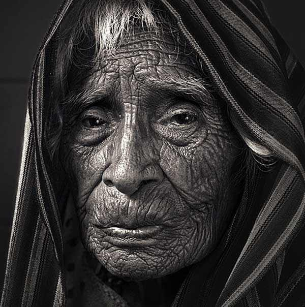
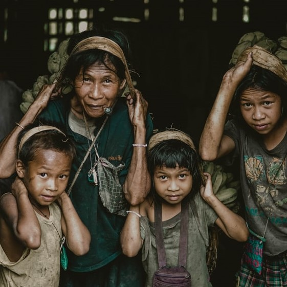

# Performance
<html>
<head>
<title> Story of Poverty Page 2 </title>
</head>
<body>
<body background="poverty4.jpg" link="#000">
 
<b><h1>
<mark> THE STORY OF POVERTY </b></h1>
</mark>
<b><h2> What is Poverty?</B></h2>
<b>Poverty is a state or condition in which a person or community lacks
  the financial resources and essentials for a minimum standard of living. 
  Poverty means that the income level from employment is so low that basic
  human needs can't be met.</b> 
 <b><h2> What is the Cycle of Poverty </b></h2>
<b> Poverty can be a trap. For someone to get out of poverty, they need opportunities such as education,
  clean water, medical facilities nearby, and financial resources. Without these basic elements, poverty 
 becomes a cycle from one generation to the next.</b>
 
&nbsp;&nbsp;&nbsp;&nbsp;&nbsp;&nbsp;&nbsp;&nbsp;&nbsp;&nbsp;&nbsp;&nbsp;&nbsp;&nbsp;&nbsp;&nbsp;&nbsp;&nbsp;&nbsp;&nbsp;&nbsp;&nbsp;&nbsp;&nbsp;&nbsp;&nbsp;&nbsp;&nbsp;&nbsp;&nbsp;&nbsp;&nbsp;&nbsp;&nbsp;&nbsp;&nbsp;&nbsp;&nbsp;&nbsp;&nbsp;&nbsp;&nbsp;&nbsp;&nbsp;&nbsp;&nbsp;&nbsp;&nbsp;&nbsp;&nbsp;&nbsp;&nbsp;&nbsp;&nbsp;&nbsp;&nbsp;&nbsp;&nbsp;&nbsp;&nbsp;&nbsp;&nbsp;&nbsp;&nbsp;&nbsp;&nbsp;&nbsp;&nbsp;&nbsp;&nbsp;&nbsp;&nbsp;&nbsp;&nbsp;&nbsp;&nbsp;&nbsp;&nbsp;&nbsp;&nbsp;&nbsp;&nbsp;&nbsp;&nbsp;&nbsp;&nbsp;&nbsp;&nbsp;&nbsp;&nbsp;&nbsp;&nbsp;&nbsp;&nbsp;&nbsp;&nbsp;

 <a href="https://scaffoldpoverty.herokuapp.com/?fbclid=IwAR1OndBXgBJQDQEqDP16G-xBHaifgEej223x_0jisnk3wF5ROqN3fSAGoX0">
 HOME PAGE </a>

</body>
</html>
